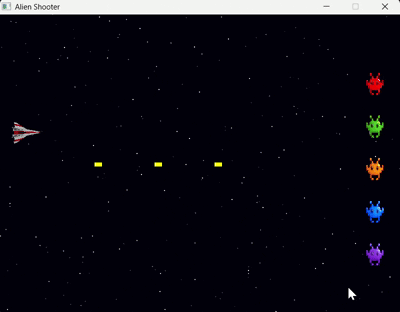

# 2D shooting game 

A 2D space shooter game built with **C++** and **SDL2**.  
Move your spaceship, shoot bullets, and destroy incoming alien enemies — including slow wobblers and fast zigzaggers!

---

##  Controls

| Key        | Action                          |
|------------|---------------------------------|
| `↑`        | Move Up                         |
| `↓`        | Move Down                       |
| `Space`    | Shoot (hold for rapid fire)     |
| `R`        | Restart (on Game Over screen)   |
| `E`        | Exit (on Game Over screen)      |

---

##  Enemy Types

| Enemy       | Speed | Movement Pattern         | Size  |
|-------------|-------|--------------------------|-------|
| SlowEnemy   | 60    | Slow + gentle wobble     | 70×70 |
| FastEnemy   | 220   | Fast + sharp zigzag      | 70×70 |

- **SlowEnemy** moves slowly across the screen with a smooth sine-wave wobble up and down.
- **FastEnemy** moves quickly with a rapid zigzag pattern, making it harder to hit.
- Both inherit from the base `Enemy` class and override the `update()` method.

---

##  Project Structure

```
shootinggame/
├── main.cpp                        ← Main game loop
├── player.h / player.cpp           ← Player (movement + shooting)
├── bullet.h / bullet.cpp           ← Bullet class
├── Enemy.h / Enemy.cpp             ← Base Enemy class
├── SlowEnemy.h                     ← Slow wobbling enemy (inherits Enemy)
├── FastEnemy.h                     ← Fast zigzag enemy (inherits Enemy)
├── EnemyManager.h / EnemyManager.cpp ← Spawns and manages all enemy types
├── Background.h / Background.cpp   ← Scrolling star background
├── assets/
│   ├── shooter.bmp                 ← Player sprite
│   ├── red.bmp                     ← Enemy sprite
│   ├── green.bmp                   ← Enemy sprite
│   ├── orange.bmp                  ← Enemy sprite
│   ├── blue.bmp                    ← Enemy sprite
│   ├── purple.bmp                  ← Enemy sprite
│   ├── explosion.wav               ← sound effect
│   ├── shoot.wav                   ← sound effect
│   ├── gameover.wav                ← sound effect
│   └── arialceb.ttf                ← Font for score/game over screen
```

---

##  Installation & Setup

### Step 1 — Install Code::Blocks
- Download from: https://www.codeblocks.org/downloads/
- Choose the version **with MinGW** (e.g. `codeblocks-20.03mingw-setup.exe`)

---

### Step 2 — Install SDL2

1. Go to: https://github.com/libsdl-org/SDL/releases
2. Download: `SDL2-2.x.x-win32-x64.zip` (or the mingw version)
3. Extract it to `C:\SDL2\`
4. Your folder should look like:
   ```
   C:\SDL2\SDL2-2.x.x\x86_64-w64-mingw32\
       ├── include\
       └── lib\
   ```
5. Copy `SDL2.dll` from `bin\` into your project's `bin\Debug\` folder

---

### Step 3 — Install SDL2_ttf (for fonts and text) 

1. Go to: https://github.com/libsdl-org/SDL_ttf/releases
2. Download: `SDL2_ttf-2.x.x-win32-x64.zip`
3. Extract it to `C:\SDL2\SDL2_ttf-2.x.x\`
4. Copy `SDL2_ttf.dll` into your project's `bin\Debug\` folder

---

### Step 4 — Install SDL2_mixer (for sound effects)
1. Go to: https://github.com/libsdl-org/SDL_mixer/releases
2. Download: `SDL2_mixer-2.x.x-win32-x64.zip`
3. Extract it to `C:\SDL2\SDL2_mixer-2.x.x\`
4. Copy `SDL2_mixer.dll` into your project's `bin\Debug\` folder

---

### Step 5 — Configure Code::Blocks

Open **Project → Build Options** and follow these steps:

#### Compiler Search Directories (Search directories → Compiler tab):
```
C:\SDL2\SDL2-2.x.x\x86_64-w64-mingw32\include
C:\SDL2\SDL2_ttf-2.x.x\x86_64-w64-mingw32\include
C:\SDL2\SDL2_mixer-2.x.x\x86_64-w64-mingw32\include
```

#### Linker Search Directories (Search directories → Linker tab):
```
C:\SDL2\SDL2-2.x.x\x86_64-w64-mingw32\lib
C:\SDL2\SDL2_ttf-2.x.x\x86_64-w64-mingw32\lib
C:\SDL2\SDL2_mixer-2.x.x\x86_64-w64-mingw32\lib
```

#### Link Libraries (Linker settings → Link libraries):
```
mingw32
SDL2main
SDL2.dll
SDL2_ttf
SDL2_mixer
user32
gdi32
winmm
dxguid
```
>  Make sure `mingw32` and `SDL2main` are at the TOP of the list.

---

### Step 6 — Add Asset Files

Copy the following files into your project's `bin\Debug\` folder:
- `shooter.bmp`
- `red.bmp`, `green.bmp`, `orange.bmp`, `blue.bmp`, `purple.bmp`
- `arialceb.ttf`
- `shoot.wav`,`explosion.wav`,`gameover.wav`

---

### Step 7 — Build and Run

1. Open the project in Code::Blocks
2. Click **Build → Clean**
3. Click **Build → Build**
4. Click **Build → Run**

---

##  Features

-  Scrolling parallax star background
-  Three enemy types — Normal, Slow (wobble), Fast (zigzag)
-  Inheritance — SlowEnemy and FastEnemy extend the base Enemy class
-  Rapid fire bullets (hold Space)
-  Collision detection — bullet destroys enemy on hit
-  Score tracking with high score saved to file
-  Game Over screen with restart or exit option
-  Sound effects for shooter,explosion and for the gameover screen

---

##  Class Design

```
Enemy (base class)
├── SlowEnemy  → overrides update() → slow speed + sine wobble
└── FastEnemy  → overrides update() → fast speed + sharp zigzag
```

EnemyManager spawns and manages all three enemy types.  
Player handles movement and fires multiple Bullet objects simultaneously.

---
##  Gameplay

Enemies spawn from the right side of the screen in columns of four
and move towards the left. The player controls a spaceship on the
left side and must shoot down the enemies before they cross the screen.
five types of enemies appear randomly — normal enemies move in a
straight line, slow enemies wobble up and down, and fast enemies
zigzag rapidly making them harder to hit. The game ends when any
enemy reaches the left edge of the screen or. Your score is saved and
the highest score is tracked across sessions.

---

##  OOP Concepts Used

| Concept         | Where Used                                              |
|-----------------|---------------------------------------------------------|
| Inheritance     | SlowEnemy and FastEnemy inherit from Enemy base class   |
| Polymorphism    | update() is virtual in Enemy, overridden in subclasses  |
| Encapsulation   | All classes use private members with public methods     |
| Abstraction     | EnemyManager hides spawning logic from main.cpp         |
| Vectors         | Used for bullets, enemies and textures                  |
| File I/O        | High score saved and read from a scores file            |

---

##  Technical Details

- **Language:** C++
- **Framework:** SDL2, SDL2_ttf, SDL2_mixer
- **IDE:** Code::Blocks with MinGW
- **Platform:** Windows
- **Architecture:** Object Oriented — each game element is its own class

---

##  Known Issues / Limitations

- Only Windows is supported currently
- BMP format only for sprites (no PNG/JPG support without SDL_image)
- No sound effects
- Player cannot move left or right, only up and down

---

##  Future Improvements

-  Sound effects and background music using SDL_mixer
-  Multiple lives and a health bar for the player
-  Increasing difficulty with each level
-  Enemies that shoot back at the player
-  Power-ups such as rapid fire or shield
-  PNG support using SDL_image
-  Cross-platform support for Linux and Mac
-  Proper save system with player name and leaderboard

---

##  References

- SDL2 Official Documentation: https://wiki.libsdl.org/
- SDL2_ttf Documentation: https://wiki.libsdl.org/SDL_ttf
- SDL2 Setup Guide for Code::Blocks: https://lazyfoo.net/tutorials/SDL/

##  Credits

Developed by **Shree Magathi k** and **S Aswini** as a C++ SDL2 project.

##  Gameplay Preview

